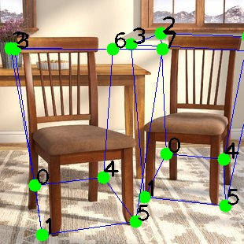
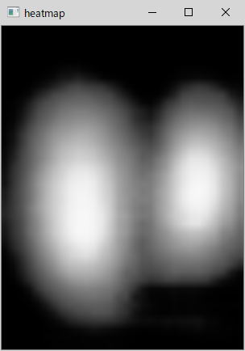

# Overview
This is a sample implementaion of 3D object detection application using Intel(r) Distribution of OpenVINO(tm) Toolkit. The program uses `objectron` model from [Google *mediapipe* project](https://github.com/google/mediapipe) to detect the objects from the input images.  
In this project, I took the `objectron` model in TF SavedModel format from [PINTO model zoo](https://github.com/PINTO0309/PINTO_model_zoo) in the GitHub.  

これはIntel(r) Distribution of OpenVINO(tm) Toolkitを使用した3D物体検出アプリケーションの参考実装です。プログラムは[Google *mediapipe*プロジェクト](https://github.com/google/mediapipe)の`objectron`モデルを使用しています。  
このプロジェクトではPINTOさんの[PINTO model zoo](https://github.com/PINTO0309/PINTO_model_zoo)からTF SavedModelフォーマットのモデルデータを使用させて頂いています。  

**Example of Detection result**  
  


## 1. Prerequisites
* [Intel Distribution of OpenVINO toolkit 2020.2 (or newer)](https://software.intel.com/content/www/us/en/develop/tools/openvino-toolkit.html)

## 2. Download Objectron TensorFlow model from PINTO model zoo
*Linux compatible environment is required to run `download.sh` script to get the model*
### 2.1 Download the model download script
 Download `download.sh` from [https://github.com/PINTO0309/PINTO_model_zoo/tree/master/36_Objectron/01_float32](https://github.com/PINTO0309/PINTO_model_zoo/tree/master/36_Objectron/01_float32)
### 2.2 Run `download.sh` to get `object_detection_3d_chair.pb`  

```sh
 ./download.sh
```

## 3. Convert objectron TF model into OpenVINO IR model

Use `Model Optimizer (MO)` to convert the TF model into IR model.

```sh
python3 ${INTEL_OPENVINO_DIR}/deployment_tools/model_optimizer/mo.py \
 --saved_model_dir saved_model_object_detection_3d_chair \
 --scale 255 \
 --output_dir objectron_chair \
 --data_type FP16
```
An IR model `./objectron_chair/saved_model.xml|.bin` will be generated.

## 4. Run sample program

```sh
python3 objectron.py [-m model.xml] [-i input_image] [--heatmap]
```
*Options*  
`-m`: IR model path (default: `./objectron_chair/saved_model.xml`)  
`-i`: Input image path. A webCam will be used as the input when you specify `cam` (default: `chair.jpg`)  
`--heatmap`: Display heatmap


**Command line example:**
```sh
 $ python3 objectron.py -m ./objectron_chair/object_detection_3d_chair.xml -i cam --heatmap
```

## 5. Test Environment
- Ubuntu 18.04 / Windows 10 1909  
- OpenVINO 2020.3 LTS  

## See Also  
* [Google AI Blog, Real-Time 3D Object Detection on Mobile Devices with MediaPipe](https://ai.googleblog.com/2020/03/real-time-3d-object-detection-on-mobile.html)
* [GitHub, Google *mediapipe* project](https://github.com/google/mediapipe)  
* [GitHub, PINTO model zoo](https://github.com/PINTO0309)  
* [Intel(r) Distribution of OpenVINO(tm) Toolkit](https://software.intel.com/content/www/us/en/develop/tools/openvino-toolkit.html)
